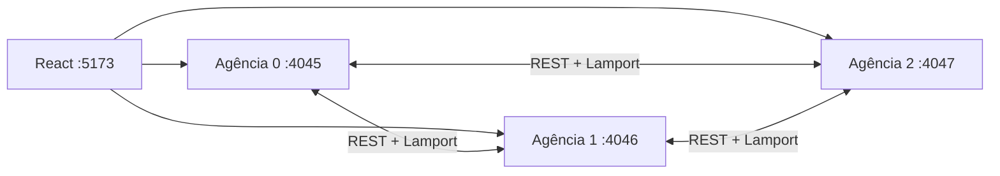

# ICEIBank

Projeto acadêmico de banco distribuído desenvolvido incrementalmente em quatro sprints. Cada agência é uma partição independente de contas, e cada sprint introduz um novo conceito de sistemas distribuídos.

## Estado atual

**Sprint 1 implementada e validada localmente em 7 de setembro de 2026.**

Decisões confirmadas:

- backend em Python com FastAPI;
- frontend em React com Vite e JavaScript;
- três agências nas portas 4045, 4046 e 4047;
- frontend na porta 5173;
- particionamento de conta por `id % 3`.

Funcionalidade adicional confirmada:

- Controle Financeiro Mensal, com renda prevista, meta de economia, gastos categorizados e recomendações de redução.

Decisão implementada:

- JWT de usuário e credencial interna separada entre agências.

## Objetivo da Sprint 1

Entregar:

- uma API REST/MVC executada como três agências independentes;
- criação/consulta de contas, depósito e saque;
- transferências locais e entre agências;
- relógio lógico de Lamport e linha do tempo unificada;
- falha remota conhecida e documentada, sem rollback;
- autenticação JWT;
- frontend React funcional;
- funcionalidade adicional;
- testes, evidências, respostas e vídeo.

## Arquitetura resumida



O mesmo código FastAPI é executado três vezes com `AGENCIA_ID` diferente. Cada processo possui contas em memória, relógio e arquivo JSONL próprios. A aplicação deve rodar com apenas um worker por agência.

## Portas e partições

| Agência | Porta | Exemplos de contas |
|---|---:|---|
| 0 | 4045 | 0, 3, 6, 9 |
| 1 | 4046 | 1, 4, 7, 10 |
| 2 | 4047 | 2, 5, 8, 11 |

## Documentação

Comece pelo [índice completo da documentação](docs/README.md).

Documentos principais:

- [Roadmap da Sprint 1](ROADMAP_SPRINT_1.md)
- [Arquitetura FastAPI/React](docs/specs/SPEC-001-arquitetura-sprint-1.md)
- [Controle Financeiro Mensal](docs/specs/SPEC-002-controle-financeiro-mensal.md)
- [Contrato da API](docs/API_SPRINT_1.md)
- [Blueprint do backend FastAPI](docs/BACKEND_FASTAPI.md)
- [Blueprint do frontend React](docs/FRONTEND_REACT.md)
- [Configuração e execução](docs/CONFIGURACAO_E_EXECUCAO.md)
- [Guia de desenvolvimento](docs/GUIA_DE_DESENVOLVIMENTO.md)
- [Plano de testes e evidências](docs/PLANO_DE_TESTES_E_EVIDENCIAS.md)
- [Plano de commits e arquivos](docs/PLANO_DE_COMMITS_SPRINT_1.md)
- [Requisitos e rastreabilidade](docs/REQUISITOS_E_RASTREABILIDADE_SPRINT_1.md)
- [Respostas da Sprint 1](RESPOSTAS.md)

## Execução

Os comandos reproduzíveis estão no [guia de configuração e execução](docs/CONFIGURACAO_E_EXECUCAO.md). Em resumo:

```powershell
Set-Location agencia
py -m venv .venv
.\.venv\Scripts\python.exe -m pip install -e ".[dev]"
```

Em três terminais, definir `AGENCIA_ID` como `0`, `1` e `2` e iniciar o Uvicorn nas portas 4045, 4046 e 4047 conforme o guia. Depois:

```powershell
Set-Location frontend
npm install
npm run dev
```

Abrir `http://localhost:5173`. O Vite encaminha `/api/agencia-0`, `/api/agencia-1` e `/api/agencia-2` para as portas exigidas. Esse proxy é necessário no Google Chrome porque a porta 4045 é bloqueada para acesso direto; as agências continuam ouvindo exatamente em 4045–4047.

Credenciais locais de demonstração: `aluno` / `iceibank123`. Altere os segredos e o hash em `agencia/.env` fora de ambientes acadêmicos locais.

## Limitações intencionais

- contas não persistem após reinício;
- planejamentos e gastos do Controle Financeiro também não persistem;
- não há replicação;
- transferência remota não é atômica;
- um 502 após o débito não devolve o dinheiro automaticamente;
- autenticação não implica autorização por titularidade;
- o sistema é acadêmico e não deve ser usado com dados ou dinheiro reais.

## Uso responsável de IA

Ferramentas de IA podem apoiar planejamento, rascunho e revisão. O aluno continua responsável por compreender, testar e defender todo o conteúdo entregue e deve declarar esse apoio de forma verdadeira em `RESPOSTAS.md`.
