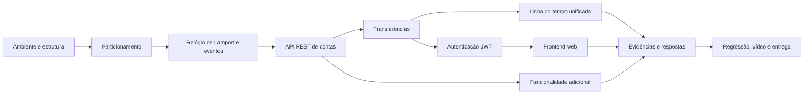

# Roadmap da Sprint 1 — ICEIBank

> Arquitetura detalhada: [SPEC-001 — Arquitetura FastAPI/React](docs/specs/SPEC-001-arquitetura-sprint-1.md). Índice completo: [documentação](docs/README.md). Divisão dos arquivos: [plano de commits](docs/PLANO_DE_COMMITS_SPRINT_1.md).

## 1. Objetivo da sprint

Entregar uma aplicação bancária web composta por um único serviço de agência executado em três instâncias independentes. Cada instância deve responder somente pelas contas da sua partição, expor uma API REST organizada em MVC, registrar as operações com relógio lógico de Lamport, realizar transferências locais e remotas, autenticar requisições com JWT e ser consumida por um frontend web.

Além das partes obrigatórias, a entrega precisa conter uma funcionalidade adicional, evidências reais de execução, respostas conceituais, histórico incremental de commits e um vídeo de apresentação.

### Resultado esperado

Ao final da sprint, deve ser possível:

1. iniciar as três agências a partir do mesmo código, alterando apenas `AGENCIA_ID`;
2. criar e consultar contas, depositar e sacar na agência responsável;
3. transferir valores entre contas da mesma agência e de agências diferentes;
4. observar nos logs a relação causal entre envio e recebimento por meio do relógio de Lamport;
5. reproduzir e explicar a inconsistência intencional quando a agência de destino está indisponível;
6. autenticar-se, receber um JWT e utilizar a API protegida;
7. executar o fluxo bancário completo pelo frontend, com mensagens de erro visíveis;
8. demonstrar uma funcionalidade adicional genuína;
9. apresentar evidências e explicar as decisões técnicas da implementação.

## 2. Estado inicial

- Repositório Git existente, na branch `main`.
- Apenas `README.md` e `LICENSE` estão presentes.
- Ainda não há código da aplicação.
- O backend será desenvolvido em **Python/FastAPI** e o frontend em **React/Vite com JavaScript modular**. Os exemplos em Node.js servem somente como referência de lógica e arquitetura.
- O offset do RA é 45: as agências usarão as portas 4045, 4046 e 4047.

## 3. Decisões do projeto

Estas decisões fazem parte do aprendizado e precisam ser documentadas em `RESPOSTAS.md` ou `README.md`.

| Decisão | Opções | Recomendação para menor risco | Critério |
|---|---|---|---|
| Linguagem/backend | **Definido: Python + FastAPI** | Decisão aceita | Familiaridade, praticidade e continuidade até a Sprint 4 |
| Frontend | **Definido: React + Vite + JavaScript modular** | Decisão aceita | Aproveitar a habilidade existente sem adicionar TypeScript nesta sprint |
| Credenciais | Usuário/senha global; conta/senha; usuários cadastrados | Usuário/senha simples configurados por ambiente | Não gastar a sprint criando um sistema completo de usuários |
| Comunicação interna | Mesmo JWT do usuário; credencial interna separada | Credencial interna separada e documentada | Distinguir tráfego do frontend de tráfego agência-a-agência |
| Funcionalidade adicional | **Definido: Controle Financeiro Mensal** | Decisão aceita | Meta de economia, gastos categorizados e recomendações transparentes |
| Portas | **Definido: 4045, 4046 e 4047** | Offset 45 aplicado | Evitar conflito em máquina compartilhada |

> Atenção: o roteiro menciona `mesclar-logs.js`, mas também proíbe que a entrega seja em Node.js. A implementação deve manter o comportamento e o formato definidos no roteiro usando a linguagem escolhida, deixando o nome/comando equivalente claramente documentado. Se o professor exigir literalmente o arquivo `.js`, essa exceção deve ser confirmada com ele.

## 4. Dependências entre as entregas



O ponto crítico é não iniciar o frontend antes de estabilizar os contratos da API e a autenticação. Isso evita refazer todas as chamadas do frontend várias vezes.

## 5. Planejamento de três semanas

### Semana 1 — Base técnica e API de contas

#### Marco 1 — Preparar o projeto

**Objetivo:** deixar o repositório pronto para crescer nas quatro sprints.

Tarefas:

- registrar a decisão já tomada por Python/FastAPI;
- aplicar o offset 45 e validar as portas 4045, 4046 e 4047;
- criar as pastas `agencia/`, `frontend/`, `evidencias/sprint1/` e os arquivos `README.md`, `RESPOSTAS.md` e `.gitignore`;
- definir variáveis de ambiente, incluindo `AGENCIA_ID`, segredo JWT e credencial interna;
- ignorar ambientes virtuais, artefatos de build, `.env` e logs `.jsonl`;
- documentar comandos de instalação e execução;
- confirmar que as três portas estão livres.

**Pronto quando:** uma aplicação mínima inicia e identifica a agência e a porta configuradas.

**Commit sugerido:**

```text
chore: estrutura inicial do projeto ICEIBank
```

#### Marco 2 — Modelar o particionamento

**Objetivo:** garantir que cada conta pertença a exatamente uma agência.

Tarefas:

- definir três agências em configuração centralizada;
- implementar `agencia_responsavel(id_conta) = id_conta % 3`;
- rejeitar criação ou operação de conta na agência incorreta;
- validar IDs inteiros e não negativos;
- testar exemplos como contas 0 e 3 na agência 0, conta 1 na agência 1 e conta 2 na agência 2.

**Pronto quando:** todos os casos de particionamento corretos são aceitos e os incorretos retornam erro HTTP coerente.

**Commit sugerido:**

```text
feat(config): define particionamento de contas entre 3 agencias
```

#### Marco 3 — Implementar e testar Lamport isoladamente

**Objetivo:** provar o algoritmo antes de integrá-lo à API.

Tarefas:

- criar um relógio por processo de agência;
- implementar `evento_local`, `ao_enviar` e `ao_receber`;
- tornar o contador seguro para concorrência conforme o framework escolhido;
- criar o registro append-only de eventos em JSON Lines;
- registrar agência, tipo, timestamp Lamport, hora de parede e detalhes;
- escrever testes unitários para incrementos locais, envio e recebimento de timestamp menor, igual e maior;
- iniciar o rascunho das respostas da seção 6.4.

**Pronto quando:** a sequência de operações produz timestamps previsíveis e cada evento gera uma linha JSON válida.

**Commit sugerido:**

```text
feat(lamport): implementa relogio logico e registro de eventos
```

#### Marco 4 — Construir a API REST/MVC de contas

**Objetivo:** disponibilizar as operações bancárias locais.

Tarefas:

- separar configuração, rotas, controladores, serviços e modelo/repositório em memória;
- implementar criação de conta, consulta de saldo, depósito e saque;
- validar corpo, IDs, valores positivos, conta duplicada, conta inexistente e saldo insuficiente;
- registrar no Lamport todas as operações que modificam estado;
- padronizar respostas e erros HTTP;
- criar testes unitários e de integração da API;
- executar manualmente as três agências simultâneas.

**Pronto quando:** o fluxo criar → consultar → depositar → sacar funciona na agência correta e falha de maneira previsível nos cenários inválidos.

**Commit sugerido:**

```text
feat(contas): implementa API REST/MVC de contas com relogio de Lamport
```

### Semana 2 — Comunicação distribuída, observabilidade e segurança

#### Marco 5 — Implementar transferências locais

**Objetivo:** mover saldo atomicamente entre duas contas da mesma agência.

Tarefas:

- validar origem, destino, valor e saldo antes de alterar estado;
- debitar e creditar dentro do mesmo processo;
- registrar os dois eventos locais em ordem;
- impedir perda de saldo se a conta de destino local não existir;
- testar saldos antes e depois da operação.

**Pronto quando:** a soma dos saldos das duas contas permanece constante após uma transferência local bem-sucedida.

#### Marco 6 — Implementar transferências entre agências

**Objetivo:** realizar comunicação REST direta entre duas instâncias.

Tarefas:

- determinar a agência de destino pela partição;
- debitar a origem localmente;
- chamar `ao_enviar` e transmitir o timestamp de Lamport;
- criar a rota interna de crédito remoto;
- no destino, chamar `ao_receber(timestamp_recebido)` antes de registrar o crédito;
- proteger a rota interna conforme a decisão de autenticação adotada;
- configurar timeout de rede e tratamento de indisponibilidade;
- registrar `TRANSFERENCIA_FALHOU` sem esconder a inconsistência exigida no roteiro;
- testar transferência bem-sucedida e destino fora do ar;
- capturar as três evidências de transferência;
- responder às perguntas da seção 8.3 a partir do comportamento observado.

**Pronto quando:** os dois tipos de transferência funcionam e a falha conhecida retorna 502, fica registrada e mantém o débito sem reversão automática, conforme pedido.

**Commit sugerido:**

```text
feat(transferencias): implementa transferencia local e entre agencias
```

#### Marco 7 — Mesclar a linha do tempo

**Objetivo:** visualizar os eventos das três agências em conjunto.

Tarefas:

- ler todos os arquivos `.jsonl` válidos;
- unir e ordenar eventos pelo timestamp de Lamport;
- usar agência e outro campo apenas como desempate de exibição, sem alegar causalidade onde ela não existe;
- gerar operações quase simultâneas em agências diferentes;
- encontrar e explicar eventos concorrentes com timestamps iguais ou sem relação causal conhecida;
- comparar Lamport com a hora de parede;
- capturar `linha-do-tempo.png`;
- responder às perguntas da seção 10.3.

**Pronto quando:** a linha do tempo pode ser reproduzida por um único comando documentado e as observações estão em `RESPOSTAS.md`.

**Commit sugerido:**

```text
feat(observabilidade): adiciona script de linha do tempo unificada
```

#### Marco 8 — Adicionar autenticação JWT

**Objetivo:** proteger a API já estabilizada.

Tarefas:

- definir formato das credenciais e documentar a escolha;
- criar `POST /auth/login`;
- emitir token assinado com expiração, identidade e horário de emissão;
- manter segredo fora do repositório;
- exigir `Authorization: Bearer <token>` nas rotas de contas e transferências;
- decidir e documentar a autenticação de chamadas internas;
- padronizar respostas 401 para token ausente, inválido e expirado;
- testar os três cenários obrigatórios e capturar as evidências;
- responder às perguntas da seção 11.3;
- repetir um teste de transferência remota depois da proteção para evitar regressão.

**Pronto quando:** uma requisição sem credencial ou com token expirado recebe 401, um token válido libera a operação e a comunicação entre agências continua funcionando.

**Commit sugerido:**

```text
feat(auth): protege a API com autenticacao JWT
```

### Semana 3 — Interface, extra e fechamento

#### Marco 9 — Construir o frontend

**Objetivo:** executar todo o fluxo obrigatório sem Postman ou PowerShell.

Tarefas:

- criar tela de login;
- guardar o token e adicioná-lo às requisições;
- permitir selecionar a agência de entrada;
- implementar consulta de saldo;
- implementar formulários de depósito e saque;
- implementar transferência sem expor ao usuário se ela é local ou remota;
- exibir sucesso e erros de negócio, rede e autenticação na própria interface;
- ao receber 401 por expiração, apagar o token e solicitar novo login;
- configurar CORS somente para a origem do frontend;
- separar cliente HTTP, estado/modelo, controladores de interação e componentes/telas;
- capturar as três evidências mínimas do frontend;
- responder às perguntas da seção 12.3.

**Pronto quando:** login, saldo, depósito, saque, transferência local, transferência remota e pelo menos um erro são demonstráveis exclusivamente pela interface.

**Commit sugerido:**

```text
feat(frontend): implementa interface web para o ICEIBank
```

#### Marco 10 — Implementar a funcionalidade adicional

**Objetivo:** entregar comportamento novo e observável, separado do escopo obrigatório.

Funcionalidade escolhida: **Controle Financeiro Mensal**, conforme a [SPEC-002](docs/specs/SPEC-002-controle-financeiro-mensal.md).

Tarefas:

- definir renda prevista, meta de economia e limites de categoria para um mês;
- registrar gastos categorizados e debitá-los da conta de forma atômica, se essa semântica for confirmada;
- calcular limite mensal, total gasto, economia projetada e ajuste necessário;
- recomendar cortes primeiro em categorias flexíveis acima do limite;
- construir a interface React de planejamento, gastos, resumo e recomendações;
- registrar planejamento e gasto com eventos Lamport;
- testar o cenário de economizar R$ 100,00 descrito na SPEC-002;
- documentar regras, limitações e resultados observados;
- capturar `funcionalidade-adicional.png`;
- fazer um commit exclusivo, sem misturar alterações obrigatórias.

**Pronto quando:** uma conta consegue definir meta de R$ 100,00, registrar gastos e receber recomendações que explicam quanto reduzir e em quais categorias; a funcionalidade possui testes, evidência e explicação em `RESPOSTAS.md`.

**Commit sugerido:**

```text
feat(extra): adiciona controle financeiro mensal
```

#### Marco 11 — Revisar, demonstrar e entregar

**Objetivo:** transformar uma implementação funcional em uma entrega verificável.

Tarefas:

- executar a matriz completa de testes em ambiente limpo;
- conferir todos os prints, incluindo `Get-Date` visível quando exigido;
- revisar `RESPOSTAS.md` enquanto os logs e resultados ainda estão disponíveis;
- atualizar `README.md` com instalação, variáveis, portas, execução das três agências, frontend e testes;
- confirmar que logs, segredos e dependências geradas não foram versionados;
- revisar `git log --oneline` e separar qualquer mudança ainda misturada;
- preparar e gravar o vídeo cobrindo funcionalidades e decisões técnicas;
- comparar a entrega final com o checklist e com os 20 pontos da rubrica.

**Pronto quando:** outra pessoa consegue clonar o repositório, seguir o README e reproduzir o fluxo completo.

**Commits sugeridos:**

```text
docs(sprint1): finaliza respostas e instrucoes de execucao
test(sprint1): adiciona evidencias finais da entrega
```

## 6. Matriz mínima de validação

| Área | Cenário | Resultado esperado |
|---|---|---|
| Partição | Criar conta 1 na agência 0 | Rejeição; a responsável é a agência 1 |
| Contas | Criar conta válida | 201 e evento com Lamport |
| Contas | Criar ID duplicado | 409 |
| Depósito | Valor positivo | Saldo aumentado e evento registrado |
| Depósito/saque | Valor zero, negativo ou inválido | Rejeição sem alterar saldo |
| Saque | Valor maior que saldo | Erro de saldo insuficiente |
| Transferência local | Duas contas da mesma partição | Débito e crédito; soma preservada |
| Transferência remota | Contas de partições diferentes | Débito e crédito em processos diferentes |
| Lamport remoto | Destino recebe timestamp do remetente | Novo timestamp igual a `max(local, recebido) + 1` |
| Falha conhecida | Destino desligado após débito | 502, evento de falha e débito não revertido |
| Logs | Eventos independentes nas três agências | Linha do tempo unificada reproduzível |
| JWT | Sem token | 401 |
| JWT | Token válido | Operação liberada |
| JWT | Token expirado ou inválido | 401 |
| Rota interna | Crédito entre agências após JWT | Comunicação continua funcionando |
| Frontend | Fluxo completo | Resultado e erros aparecem na tela |
| Extra | Caso feliz e pelo menos um erro | Comportamento documentado e evidenciado |

## 7. Evidências obrigatórias

Salvar em `evidencias/sprint1/`:

- `transferencia-local.png`;
- `transferencia-entre-agencias.png`;
- `falha-conhecida.png`;
- `linha-do-tempo.png`;
- `auth-sem-token.png`;
- `auth-com-token.png`;
- `auth-token-expirado.png`;
- `frontend-login.png`;
- `frontend-transferencia.png`;
- `frontend-erro.png`;
- `funcionalidade-adicional.png`.

Cada evidência deve mostrar o comportamento em execução, e não apenas o código. Quando solicitado pelo roteiro, deixar a saída de `Get-Date` visível.

## 8. Estratégia para `RESPOSTAS.md`

Não deixar as respostas para o último dia. Preencher o arquivo ao concluir cada marco:

- Parte B: regra de recebimento do Lamport e efeito de mensagens atrasadas;
- Parte D: diferença entre transferência local e remota, falha conhecida e alternativas futuras como 2PC/Saga;
- Parte E: limite do relógio de Lamport para distinguir causalidade de concorrência;
- Parte F: autenticação versus autorização, validação sem sessão e risco de vazamento do segredo;
- Parte G: armazenamento/reenvio do token, expiração durante o uso e separação MVC no frontend;
- funcionalidade adicional: propósito, escolha, comportamento e teste;
- decisões JWT: credenciais, expiração e autenticação da comunicação interna.

As respostas devem citar o que foi realmente observado nos testes, não apenas repetir definições teóricas.

## 9. Priorização pelos 20 pontos

| Prioridade | Itens | Pontos relacionados |
|---|---|---:|
| Crítica | API de contas, partição, Lamport e frontend | 11 |
| Alta | Transferências, falha conhecida e JWT | 4 |
| Média | Extra, commits e respostas | 3 |
| Obrigatória para fechamento | Vídeo de apresentação | 2 |

Se houver atraso, manter somente o MVP definido na SPEC-002 e reduzir sofisticação visual. Não adicionar gráficos, recorrências, várias metas ou IA externa. Não remover comportamento obrigatório, validações, evidências ou documentação.

## 10. Principais riscos e prevenção

| Risco | Consequência | Prevenção |
|---|---|---|
| Começar pelo frontend | Retrabalho quando API/JWT mudar | Estabilizar contratos e autenticação antes |
| Implementar o backend em Node.js | Entrega fora das regras | Usar Python/FastAPI desde o primeiro commit de código |
| Usar múltiplos workers na mesma agência sem estado compartilhado | Relógios e contas divergentes | Na Sprint 1, executar um processo/worker por agência |
| Condição de corrida no contador ou no saldo | Eventos e saldos incorretos | Sincronização/lock e testes concorrentes básicos |
| Alterar saldo antes de validar a transferência local | Perda indevida de dinheiro | Validar ambas as contas e o valor antes da mutação |
| “Corrigir” a falha remota agora | Desviar do objetivo didático | Registrar e demonstrar a falha; solução transacional fica para a Sprint 4 |
| Segredo JWT versionado | Qualquer pessoa pode forjar tokens | Variável de ambiente, `.env.example` sem segredo e `.env` ignorado |
| Proteger a rota interna sem atualizar o cliente remoto | Transferências deixam de funcionar | Teste de regressão imediatamente após JWT |
| Misturar tudo em um commit | Perda de ponto e baixa rastreabilidade | Um commit por parte concluída e extra isolado |
| Tirar prints apenas no fim | Falta de evidência difícil de reproduzir | Capturar evidência junto de cada marco |

## 11. Checklist de encerramento

- [x] Python/FastAPI escolhido e justificado.
- [x] Mesmo código inicia as três agências com identidades diferentes.
- [x] Particionamento por `id_conta % 3` validado.
- [x] Criação, saldo, depósito e saque funcionam e geram eventos.
- [x] As três regras do relógio de Lamport foram testadas.
- [x] Transferências local e remota funcionam.
- [x] Falha remota intencional retorna 502 e foi documentada.
- [x] Linha do tempo unificada demonstra eventos das três agências.
- [x] Login JWT, expiração e proteção das rotas estão implementados; falta a captura específica de expiração.
- [x] Comunicação interna continua funcionando depois do JWT.
- [x] Frontend cobre todos os fluxos e mostra erros.
- [ ] Funcionalidade adicional possui commit e evidência próprios.
- [ ] Todas as imagens obrigatórias estão em `evidencias/sprint1/`.
- [ ] `RESPOSTAS.md` cobre as seções 6.4, 8.3, 10.3, 11.3 e 12.3.
- [x] `README.md` permite reproduzir a aplicação do zero.
- [ ] Histórico de commits é incremental e legível.
- [ ] Vídeo apresenta funcionalidades e principais decisões.
- [x] Nenhum segredo, log de execução ou dependência gerada foi versionado.

## 12. Próximos passos de entrega

Com a implementação concluída, restam atividades que dependem da entrega final:

1. capturar as evidências PNG listadas no plano de testes;
2. revisar `RESPOSTAS.md` com os dados reais e a linguagem do aluno;
3. criar os commits na ordem prevista somente quando autorizado;
4. gravar o vídeo após as evidências e o histórico estarem prontos.

Python/FastAPI, React/Vite, o offset 45 e o Controle Financeiro Mensal estão implementados. O gasto debita o saldo atomicamente com seu registro. O aluno ainda deve revisar e ser capaz de explicar as decisões registradas nos ADRs.
