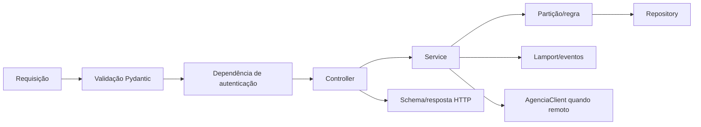

# Blueprint do backend FastAPI

## Status

Implementado em `agencia/src/iceibank`, com controllers, services, repositories, models/schemas e dependências FastAPI separadas.

## Objetivo

Traduzir os exemplos Node.js do roteiro para FastAPI sem copiar sua estrutura literalmente e sem perder os conceitos avaliados.

## Processo de uma agência

Cada processo cria exatamente uma instância de:

- `Settings` validada;
- `ContaRepository` em memória;
- `ControleFinanceiroRepository` em memória;
- `RelogioLamport`;
- `RegistroEventos`;
- `AgenciaClient`;
- serviços de contas, transferência, autenticação, controle financeiro e recomendações.

Essas instâncias vivem durante todo o processo. Não devem ser recriadas por requisição.

## Inicialização e encerramento

O ciclo de vida FastAPI deve:

1. carregar e validar configurações;
2. recusar `AGENCIA_ID` fora de 0–2;
3. calcular porta/identidade e URLs conhecidas;
4. criar `agencia/data/` se necessário;
5. instanciar estado compartilhado do processo;
6. registrar no terminal a agência iniciada, sem segredos;
7. fechar o cliente HTTP no encerramento.

## Pipeline de requisição



## Configuração

`Settings` deve expor valores tipados e imutáveis após o início:

- `agencia_id`;
- `porta_base`;
- `numero_agencias`;
- `agencias` calculadas;
- `jwt_secret`;
- `jwt_expiracao_minutos`;
- `auth_username`;
- `auth_password_hash`;
- `internal_token`;
- `frontend_origin`;
- `timeout_agencia_segundos`.

Falha de configuração deve impedir o início, não aparecer somente na primeira requisição.

## Interfaces implementadas

As assinaturas abaixo definem intenção, não código final.

### Relógio

```text
evento_local() -> int
ao_enviar() -> int
ao_receber(timestamp_recebido: int) -> int
```

As três operações usam o mesmo lock.

### Repositório de contas

```text
criar(conta: Conta) -> Conta
obter(id_conta: int) -> Conta | None
depositar(id_conta: int, valor: Decimal) -> Conta
sacar(id_conta: int, valor: Decimal) -> Conta
transferir_local(id_origem: int, id_destino: int, valor: Decimal) -> tuple[Conta, Conta]
quantidade() -> int
```

O repositório não retorna o dicionário interno. Operações compostas precisam preservar atomicidade local.

### Registro de eventos

```text
registrar(tipo: TipoEvento, timestamp: int, detalhes: dict) -> Evento
caminho_arquivo() -> Path
```

O registro serializa `Decimal`, horário UTC e detalhes de forma consistente.

### Cliente de agência

```text
creditar_remoto(
    agencia_destino: int,
    id_conta: int,
    valor: Decimal,
    timestamp_lamport: int,
    origem_agencia: int
) -> CreditoRemotoResponse
```

Ele resolve a URL a partir da configuração, nunca de entrada arbitrária do usuário.

### Repositório de controle financeiro

```text
salvar_planejamento(planejamento: PlanejamentoMensal) -> PlanejamentoMensal
obter_planejamento(conta_id: int, competencia: str) -> PlanejamentoMensal | None
registrar_gasto(gasto: Gasto) -> Gasto
listar_gastos(conta_id: int, competencia: str) -> list[Gasto]
```

O repositório usa a chave `(conta_id, competencia)` e compartilha a estratégia de sincronização necessária para coordenar registro de gasto e débito da conta.

## Serviços

### ContaService

Responsabilidades:

- validar partição;
- criar/consultar conta;
- depositar/sacar;
- coordenar repositório, Lamport e log;
- lançar exceções de domínio.

### TransferenciaService

Responsabilidades:

- validar origem, destino, valor e saldo;
- distinguir fluxo local/remoto;
- aplicar débito e crédito local;
- gerar timestamp de envio;
- chamar `AgenciaClient`;
- registrar falha remota e preservar débito;
- nunca implementar compensação automática nesta sprint.

### AuthService

Responsabilidades:

- validar senha contra hash;
- emitir JWT com claims e expiração;
- decodificar apenas algoritmos permitidos;
- transformar falhas em resultados controlados;
- não conhecer contas.

### ControleFinanceiroService

Responsabilidades:

- validar conta, partição e competência;
- criar/substituir planejamento;
- registrar gasto categorizado;
- coordenar gasto e débito de saldo na mesma seção crítica, se essa semântica for confirmada;
- calcular totais e economia projetada;
- registrar os eventos Lamport do extra.

### RecomendacaoEconomiaService

Responsabilidades:

- receber apenas dados financeiros já validados;
- calcular o ajuste necessário;
- priorizar categorias flexíveis acima do limite;
- usar a regra complementar de até 20% quando necessário;
- retornar recomendações com valor e motivo, sem mutar estado.

## Dependências FastAPI

Dependências instaladas:

```text
get_settings
get_conta_service
get_transferencia_service
get_auth_service
get_controle_financeiro_service
get_usuario_atual
validar_token_interno
```

Controllers usam `Depends`. Testes podem substituir dependências sem alterar regra de negócio.

## Exceções de domínio

| Exceção | Código HTTP | Código público |
|---|---:|---|
| `ContaForaDaParticao` | 400 | `CONTA_FORA_DA_PARTICAO` |
| `ValorInvalido` | 400 | `VALOR_INVALIDO` |
| `SaldoInsuficiente` | 400 | `SALDO_INSUFICIENTE` |
| `ContasIguais` | 400 | `CONTAS_IGUAIS` |
| `ContaNaoEncontrada` | 404 | `CONTA_NAO_ENCONTRADA` |
| `ContaJaExiste` | 409 | `CONTA_JA_EXISTE` |
| `AgenciaIndisponivel` | 502 | `AGENCIA_DESTINO_INDISPONIVEL` |

Autenticação possui tratamento separado para produzir 401 e o cabeçalho apropriado quando aplicável.

## Ordem de mutações e eventos

### Criar/depositar/sacar

1. validar;
2. entrar na seção crítica;
3. alterar estado;
4. incrementar Lamport;
5. registrar evento;
6. liberar seção crítica e responder.

Se a escrita do JSONL falhar, a exceção é propagada como erro interno e o sistema não finge que o evento foi persistido. Como o estado é apenas em memória e não existe transação com o arquivo, a mutação pode já ter ocorrido; essa é uma limitação operacional documentada da Sprint 1.

### Transferência local

Validar as duas contas antes de alterar qualquer saldo. Débito e crédito pertencem a uma única operação crítica local, embora gerem dois eventos Lamport consecutivos.

### Transferência remota

- débito local é confirmado antes da rede;
- nenhum lock de saldo fica aberto durante `await` da rede;
- falha de rede não reverte o débito;
- timeout vira 502 controlado;
- resposta 4xx do destino também é tratada como falha remota na origem, preservando a limitação do roteiro.

## Sincronização

O projeto usará um processo/worker por agência, mas ainda poderá atender requisições concorrentes. O tipo de lock deve ser compatível com a implementação escolhida:

- serviços totalmente síncronos: `threading.RLock`;
- serviços assíncronos que compartilham estado no event loop: `asyncio.Lock`;
- não misturar os dois modelos sem um motivo documentado.

A escolha final deve ser única e coberta por testes. Nenhum lock pode atravessar chamada de rede remota.

## Dependências de terceiros previstas

Categorias, sem fixar versões antes do scaffolding:

- FastAPI e servidor ASGI;
- cliente HTTP assíncrono;
- biblioteca JWT;
- biblioteca de hash de senha;
- carregamento/validação de configurações;
- pytest e cliente de teste;
- ferramentas de lint/formatação escolhidas no Marco 1.

Versões diretas devem ser fixadas em `pyproject.toml` e no lockfile.

## Testabilidade

- relógio pode ser instanciado isoladamente;
- repositório novo por teste;
- cliente remoto substituível por fake/mock;
- horário/token expirado controlável em teste;
- dependências FastAPI sobrescrevíveis;
- diretório de logs apontável para pasta temporária;
- nenhum teste depende da ordem de execução de outro teste.

## Critérios de revisão do backend

- controller sem regra financeira;
- partição centralizada;
- saldo nunca usa `float` internamente;
- uma única instância de relógio por app;
- rota interna autenticada;
- 502 preserva o débito conforme o roteiro;
- extra financeiro mantém gasto e débito localmente consistentes;
- recomendações não mutam estado nem chamam serviços externos;
- logs sem segredos;
- testes cobrem erros antes de capturar evidências.

## Referências

- [Arquitetura](specs/SPEC-001-arquitetura-sprint-1.md)
- [Contrato da API](API_SPRINT_1.md)
- [Guia de desenvolvimento](GUIA_DE_DESENVOLVIMENTO.md)
- [Lamport e observabilidade](LAMPORT_E_OBSERVABILIDADE.md)
