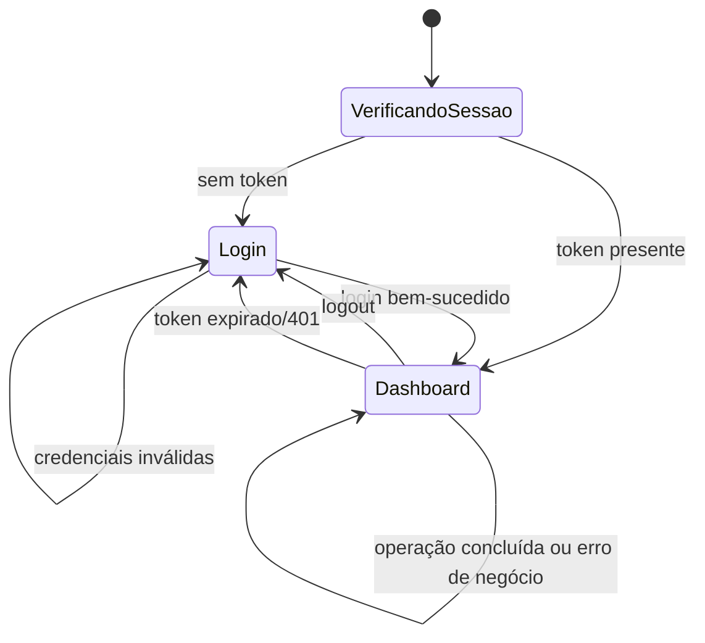

# Blueprint do frontend React

## Status

Implementado e validado com lint e build de produção em 05/10/2026. O estado
atual de todas as funcionalidades está em [Estado atual do projeto](ESTADO_ATUAL_DO_PROJETO.md).

## Objetivo

Permitir que o usuário realize login, selecione uma agência e execute todo o fluxo bancário autenticado, recebendo mensagens claras de sucesso e erro.

## Estrutura implementada

```text
frontend/src/
├── api/
│   ├── cliente.js
│   └── erros.js
├── components/
│   ├── AgenciaSelector.jsx
│   ├── AlertMessage.jsx
│   ├── CaixinhaPanel.jsx
│   ├── ContaCard.jsx
│   ├── GastoForm.jsx
│   ├── MovimentacaoForm.jsx
│   ├── PlanejamentoMensalForm.jsx
│   ├── RecomendacoesEconomia.jsx
│   ├── ResumoFinanceiro.jsx
│   ├── TransferenciaForm.jsx
│   └── GastosDoMesList.jsx
├── context/
│   ├── AuthContext.jsx
│   └── AgenciaContext.jsx
├── hooks/
│   ├── useAuth.js
│   ├── useAgencia.js
│   └── useContas.js
├── pages/
│   ├── LoginPage.jsx
│   └── DashboardPage.jsx
├── App.jsx
└── main.jsx
```

Os nomes podem mudar, mas cliente HTTP, autenticação e seleção de agência precisam continuar centralizados.

## Navegação

Estados principais:



Não é obrigatório instalar uma biblioteca de rotas para duas telas. A decisão pode ser tomada no scaffolding; a experiência deve impedir acesso ao dashboard sem sessão.

## Estado de autenticação

Interface conceitual:

```text
token: string | null
status: "verificando" | "anonimo" | "autenticado"
usuario: string | null
login(usuario, senha)
logout(motivo?)
```

Regras:

- ler `localStorage` uma vez na inicialização;
- não considerar token presente como prova definitiva de validade;
- a API continua sendo autoridade;
- apagar token no logout e em 401;
- mostrar motivo amigável quando a sessão expirar;
- nunca imprimir token no console.

## Estado da agência

Interface conceitual:

```text
agenciaId: 0 | 1 | 2
agenciaUrl: string
selecionarAgencia(id)
```

Regras:

- IDs e URLs vêm de uma lista fechada criada pelas variáveis Vite;
- seleção pode persistir em `localStorage`;
- valor inválido volta para Agência 0;
- mudar agência limpa resultados de conta exibidos para evitar confusão;
- o mesmo JWT é aceito pelas três agências.

As URLs padrão do cliente são caminhos relativos `/api/agencia-{id}`. O Vite encaminha esses caminhos às portas 4045–4047 para contornar o bloqueio de porta insegura do Google Chrome sem alterar as portas exigidas no roteiro.

## Cliente HTTP

O cliente recebe caminho e opções, então:

1. resolve a URL da agência selecionada;
2. adiciona `Content-Type` quando houver JSON;
3. adiciona JWT quando a rota for autenticada;
4. executa a chamada;
5. tenta interpretar o envelope de sucesso/erro;
6. transforma falhas em `ApiError` consistente;
7. em 401, encerra a sessão;
8. em falha de rede, informa qual agência estava indisponível.

Componentes não usam `fetch` diretamente.

## Modelo de erro do frontend

```text
status: number | null
codigo: string
mensagem: string
detalhes: object | null
tipo: "negocio" | "autenticacao" | "rede" | "inesperado"
```

Mapeamentos mínimos:

| Código/backend | Mensagem/ação da interface |
|---|---|
| `CREDENCIAIS_INVALIDAS` | “Usuário ou senha inválidos.” |
| `TOKEN_EXPIRADO` | avisar expiração e voltar ao login |
| `CONTA_NAO_ENCONTRADA` | informar conta/agência selecionada |
| `CONTA_FORA_DA_PARTICAO` | orientar a selecionar a agência responsável |
| `SALDO_INSUFICIENTE` | mostrar erro sem limpar o formulário inteiro |
| `AGENCIA_DESTINO_INDISPONIVEL` | exibir a inconsistência conhecida do débito |
| falha de rede | informar que a agência selecionada não respondeu |

## Página de login

Elementos:

- campo de usuário;
- campo de senha;
- botão de entrar;
- indicador de carregamento;
- mensagem de credenciais inválidas;
- seleção da agência de entrada, se necessária antes do login.

Regras:

- impedir múltiplos envios enquanto carrega;
- não manter senha depois do sucesso;
- não revelar se o usuário existe;
- permitir envio pelo teclado;
- associar labels aos campos.

## Dashboard

Blocos mínimos:

1. cabeçalho sticky com agência, usuário e logout;
2. conta carregada automaticamente para a agência selecionada e criação apenas
   quando não há conta local;
3. abas para Movimentações, Reserva financeira e Controle financeiro;
4. formulário único para depósito/saque e formulário de transferência;
5. Caixinhas com cartões, modal de detalhes, gerenciamento e organização;
6. controle financeiro mensal e gastos categorizados;
7. Toastify para retorno de sucesso, aviso e erro.

Uma única página é suficiente. O design deve priorizar clareza do fluxo e legibilidade dos resultados.

## Formulários

### Conta

- a conta da agência selecionada é carregada automaticamente;
- se a agência não tiver conta, a interface oferece criação com nome e saldo inicial;
- o saldo é atualizado após movimentação de conta, gasto ou atividade relevante
  de Caixinha.

### Movimentação de saldo

- um seletor define depósito ou saque para a conta carregada;
- valor maior que zero;
- desabilitar durante chamada;
- atualizar saldo exibido após sucesso;
- preservar mensagem de erro até nova tentativa ou fechamento.

### Transferência

- origem, destino e valor;
- impedir IDs iguais no cliente, sem dispensar validação do servidor;
- enviar sempre para a agência responsável pela origem selecionada;
- não implementar lógica local/remota no React;
- mostrar o `tipo` retornado apenas como resultado;
- em 502, destacar que o débito pode ter sido aplicado.

### Controle financeiro mensal

- selecionar conta e competência;
- informar renda prevista e meta de economia;
- gerenciar categorias personalizadas, limites, flexibilidade e prioridade por
  arrastar/soltar;
- registrar descrição, valor, categoria e data de cada gasto;
- exibir limite mensal, total gasto, economia projetada e valor de ajuste;
- mostrar recomendações com categoria, valor sugerido e motivo;
- deixar claro que recomendações são matemáticas e não aconselhamento profissional;
- se o débito do gasto for confirmado, atualizar também o saldo exibido da conta.

### Caixinhas

- criar Caixinha em modal e selecioná-la pelo cartão;
- consultar valor armazenado, rendimento e histórico em modal amplo;
- guardar ou resgatar valor, atualizando o saldo da conta;
- editar nome/cor e excluir com resgate automático;
- organizar cartões por arrastar/soltar ou setas e salvar a ordem.

## MVC no frontend

- Model: estado de contexts/hooks e contratos normalizados.
- View: páginas e componentes JSX.
- Controller: handlers/hooks que validam a interação e chamam o cliente.

React mistura View e Controller com facilidade. Extrair lógica repetida para hooks/cliente é suficiente; não criar uma camada cerimonial sem comportamento.

## Acessibilidade mínima

- labels conectadas aos inputs;
- foco visível;
- botões com texto claro;
- mensagens de erro em região anunciável (`role="alert"` quando apropriado);
- não depender apenas de cor;
- valores monetários formatados em português brasileiro para exibição;
- navegação básica por teclado.

## Segurança

- não usar `dangerouslySetInnerHTML`;
- não inserir texto de erro como HTML;
- limpar sessão em 401;
- não expor token interno;
- não permitir URL arbitrária de agência;
- não armazenar senha;
- não registrar JWT.

## Validação do frontend

- login válido/inválido;
- recarregar página com token salvo;
- expiração durante uma operação;
- alternar agência;
- consultar conta existente/inexistente;
- depósito/saque e erro de saldo;
- transferência local/remota;
- 502 visível;
- agência selecionada fora do ar;
- criar planejamento com meta de R$ 100,00;
- registrar gastos e conferir débito/saldo conforme a semântica confirmada;
- mostrar recomendações de Delivery e Lazer do cenário da SPEC-002;
- lint e build de produção;
- capturas obrigatórias.

## Limites atuais da interface

- não há testes end-to-end automatizados;
- a ordem e os dados das Caixinhas são persistidos apenas enquanto a agência
  permanece em execução;
- os tokens de paleta ainda não foram centralizados além dos tokens CSS atuais;
- não há tema escuro nem biblioteca de componentes externa.

## Referências

- [Arquitetura](specs/SPEC-001-arquitetura-sprint-1.md)
- [Contrato da API](API_SPRINT_1.md)
- [Segurança](SEGURANCA.md)
- [Plano de testes](PLANO_DE_TESTES_E_EVIDENCIAS.md)
- [SPEC-002 — Controle Financeiro Mensal](specs/SPEC-002-controle-financeiro-mensal.md)
