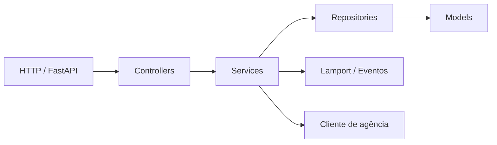

# Guia de desenvolvimento — Sprint 1

## Objetivo

Orientar a implementação sem misturar responsabilidades ou perder a rastreabilidade acadêmica. Este projeto é individual; todo código entregue deve ser compreendido e defendido pelo aluno.

## Ordem de implementação

1. estrutura, dependências e configuração;
2. particionamento;
3. relógio de Lamport;
4. registro de eventos;
5. repositório e serviço de contas;
6. controllers da API de contas;
7. transferência local;
8. cliente REST e transferência remota;
9. mesclador de logs;
10. JWT e credencial interna;
11. frontend React;
12. funcionalidade adicional;
13. regressão, respostas, evidências e vídeo.

Não começar pelo frontend. O contrato da API e a autenticação precisam estar estáveis primeiro.

## Limites entre camadas



### Controllers

Devem:

- declarar rota, schema, autenticação e status HTTP;
- chamar um serviço;
- converter erros de domínio em respostas.

Não devem:

- calcular partição;
- acessar diretamente o dicionário de contas;
- alterar saldo;
- implementar regras do relógio;
- realizar chamadas HTTP diretamente.

### Services

Devem:

- concentrar regras bancárias e fluxo de casos de uso;
- validar partição e estado;
- coordenar repositório, relógio, registro e cliente remoto;
- preservar a falha conhecida da transferência remota.

### Repositories

Devem:

- encapsular armazenamento em memória;
- impedir que o dicionário interno escape;
- oferecer operações sincronizadas;
- não conhecer FastAPI, JWT ou HTTP.

### Models e schemas

- Models representam domínio interno.
- Schemas representam entrada e saída HTTP.
- Dinheiro usa `Decimal` internamente.
- Schemas rejeitam IDs negativos, nomes vazios e valores não positivos.

### Infraestrutura

- `agencia_client.py` conhece HTTP entre agências.
- `registro_eventos.py` conhece JSONL e terminal.
- `security.py` conhece JWT/hash/cabeçalhos.
- Código de domínio não importa React ou bibliotecas HTTP.

## Convenções de código Python

- arquivos, funções e variáveis: `snake_case`;
- classes: `PascalCase`;
- constantes: `UPPER_SNAKE_CASE`;
- contratos JSON: `camelCase` por compatibilidade com o roteiro;
- funções pequenas, com uma responsabilidade observável;
- type hints em interfaces públicas;
- exceções de domínio específicas, sem usar `Exception` como controle normal;
- imports absolutos a partir de `iceibank`;
- evitar globais mutáveis; criar estado no ciclo de vida da aplicação;
- não usar `float` para saldo ou valor;
- não registrar dados de autenticação.

## Convenções de código React

- componentes e páginas: `PascalCase.jsx`;
- hooks: prefixo `use`;
- módulos utilitários: `camelCase.js`;
- um cliente HTTP central;
- contexts apenas para estado realmente global: autenticação e agência;
- formulários controlados e validação básica antes da chamada;
- toda promessa deve tratar sucesso, erro e estado de carregamento;
- mensagens da API devem aparecer na tela, não somente no console;
- componentes visuais não escolhem portas nem montam cabeçalhos JWT diretamente.

## Concorrência e atomicidade local

- As operações do relógio usam lock.
- Escritas no JSONL usam lock.
- Débito/crédito local ocorre na mesma seção crítica.
- Depósito e saque validam e alteram o saldo atomicamente.
- Nenhum lock deve permanecer adquirido durante uma chamada HTTP remota.
- No fluxo remoto, debitar, liberar a seção crítica e chamar o destino preserva a falha conhecida do roteiro.

## Dinheiro

- Converter entrada para `Decimal` na fronteira.
- Normalizar para duas casas decimais.
- Rejeitar mais casas se essa for a política implementada; não arredondar silenciosamente.
- Testar `0.10 + 0.20` e operações com centavos.
- Nunca aceitar `NaN`, infinito, zero ou valores negativos.

## Relógio de Lamport

- Um relógio por processo/agência.
- Consultar o resumo financeiro não incrementa o relógio.
- Definir planejamento e registrar gasto são eventos locais.
- Operação local que altera estado chama `evento_local`.
- Antes de enviar mensagem remota, chamar `ao_enviar`.
- Ao aceitar mensagem interna válida, chamar `ao_receber` antes da regra de crédito.
- Hora de parede serve apenas para diagnóstico.

## Fluxo para criar um endpoint

1. adicionar ou revisar requisito rastreável;
2. definir schema de entrada e saída;
3. escrever teste do serviço;
4. implementar regra no serviço;
5. escrever teste do controller/API;
6. adicionar rota;
7. testar manualmente;
8. atualizar contrato e README se necessário;
9. capturar evidência quando exigida;
10. fazer commit focado.

## Estratégia de testes

- Unitários testam regra sem servidor real.
- Integração testa FastAPI e contratos HTTP.
- Transferência remota precisa de teste com cliente simulado e de execução com duas instâncias reais.
- JWT precisa de relógio controlável ou token de duração curta no teste.
- Falha conhecida precisa verificar simultaneamente resposta 502, saldo debitado e evento de falha.
- Frontend precisa ao menos passar por lint/build e teste manual completo.

## Política de commits

O inventário detalhado de arquivos novos e modificados por etapa está no [Plano de commits da Sprint 1](PLANO_DE_COMMITS_SPRINT_1.md).

Sequência mínima sugerida:

```text
chore: estrutura inicial do projeto ICEIBank
feat(config): define particionamento de contas entre 3 agencias
feat(lamport): implementa relogio logico e registro de eventos
feat(contas): implementa API REST/MVC de contas com relogio de Lamport
feat(transferencias): implementa transferencia local e entre agencias
feat(observabilidade): adiciona linha do tempo unificada
feat(auth): protege a API com autenticacao JWT
feat(frontend): implementa interface web para o ICEIBank
feat(extra): adiciona controle financeiro mensal
docs(sprint1): finaliza respostas e instrucoes de execucao
```

O commit `feat(extra)` deve conter somente o Controle Financeiro Mensal, seus testes, documentação e evidência. Não misturar ajustes das partes obrigatórias.

Regras:

- um commit deve representar uma intenção principal;
- não misturar a funcionalidade adicional com partes obrigatórias;
- revisar `git diff` antes de adicionar arquivos;
- não reescrever histórico já entregue sem necessidade;
- evidências entram junto da parte demonstrada ou em commit documental claro;
- todos os commits devem ser do aluno.

## Revisão antes de considerar um marco pronto

- [ ] requisito está identificável;
- [ ] controller não contém regra de negócio;
- [ ] caso feliz e erros foram testados;
- [ ] Lamport foi aplicado no ponto correto;
- [ ] saldo permanece coerente com o comportamento exigido;
- [ ] nenhum segredo aparece no diff/log;
- [ ] documentação continua verdadeira;
- [ ] evidência foi capturada, se aplicável;
- [ ] o aluno consegue explicar o código sem ler uma resposta pronta.

## Uso responsável de IA

Ferramentas de IA podem apoiar planejamento, rascunho, revisão e depuração. Para cada sugestão aceita:

1. ler e explicar o raciocínio;
2. adaptar ao projeto em vez de copiar mecanicamente;
3. executar os testes;
4. registrar o uso na entrega;
5. não afirmar que um teste foi realizado quando ele não foi.

## Referências

- [Roadmap](../ROADMAP_SPRINT_1.md)
- [Arquitetura](specs/SPEC-001-arquitetura-sprint-1.md)
- [Contrato da API](API_SPRINT_1.md)
- [Plano de testes](PLANO_DE_TESTES_E_EVIDENCIAS.md)
