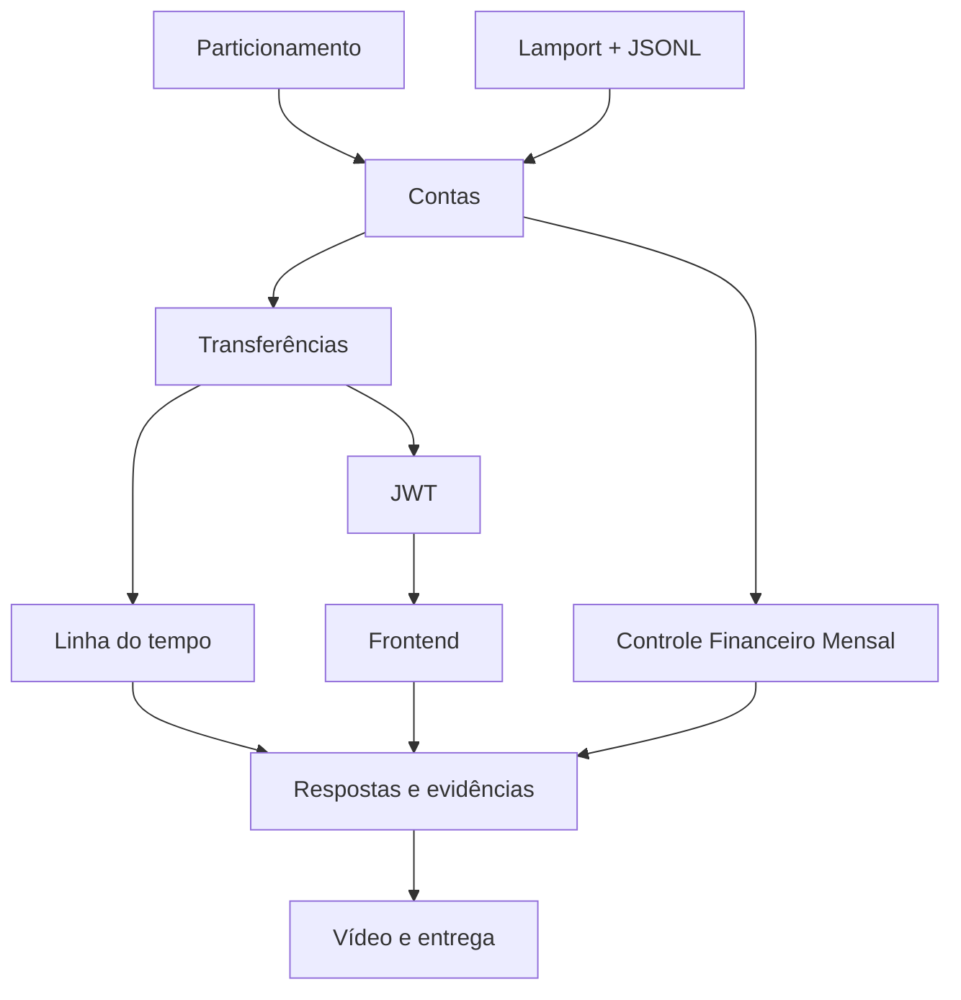

# Requisitos e rastreabilidade — Sprint 1

## Objetivo

Transformar o roteiro em requisitos verificáveis e ligar cada requisito à arquitetura, ao teste e à evidência correspondente. Os estados abaixo refletem a execução histórica da Sprint 1; a branch evoluiu para a Sprint 2. PNGs e vídeo continuam pendentes. Revisado em 11/10/2026.

## Legenda

| Estado | Significado |
|---|---|
| Planejado | arquitetura definida, código ainda não concluído |
| Implementado | comportamento existe no código |
| Validado | teste executado com resultado esperado |
| Evidenciado | prova visual ou automatizada anexada |
| Bloqueado | depende de decisão ou condição externa |

## Requisitos funcionais

| ID | Requisito | Componente responsável | Validação principal | Evidência | Estado |
|---|---|---|---|---|---|
| REQ-EST-001 | Executar o mesmo serviço como três agências | `main.py`, configuração | três processos nas portas 4045–4047 | terminais/vídeo | Validado |
| REQ-PAR-001 | Calcular agência por `id_conta % 3` | `core/config.py` | testes com IDs 0–11 | testes/logs | Validado |
| REQ-PAR-002 | Recusar conta fora da partição local | `conta_service.py` | conta 1 enviada à agência 0 | resposta HTTP | Validado |
| REQ-CON-001 | Criar conta | contas controller/service | criação válida e duplicada | frontend/vídeo | Implementado |
| REQ-CON-002 | Consultar conta e saldo | contas controller/service | existente e inexistente | frontend/vídeo | Implementado |
| REQ-CON-003 | Depositar valor positivo | contas controller/service | valor válido e inválido | frontend/vídeo | Implementado |
| REQ-CON-004 | Sacar com saldo suficiente | contas controller/service | sucesso e saldo insuficiente | `frontend-erro.png` | Validado |
| REQ-LAM-001 | Incrementar evento local | `relogio_lamport.py` | teste unitário | logs/teste | Validado |
| REQ-LAM-002 | Incrementar ao enviar | `relogio_lamport.py` | teste unitário e transferência remota | logs | Validado |
| REQ-LAM-003 | Aplicar `max(local, recebido)+1` ao receber | `relogio_lamport.py` | timestamp menor/maior | logs | Validado |
| REQ-LOG-001 | Registrar eventos em JSONL por agência | `registro_eventos.py` | uma linha JSON válida por evento | arquivos locais/terminal | Validado |
| REQ-TRF-001 | Transferir entre contas da mesma agência | transferência service | contas 0 → 3 | `transferencia-local.png` | Validado |
| REQ-TRF-002 | Transferir diretamente entre agências | transferência service/client | contas 0 → 1 | `transferencia-entre-agencias.png` | Validado |
| REQ-TRF-003 | Registrar falha sem reverter o débito remoto | transferência service | destino desligado | `falha-conhecida.png` | Validado |
| REQ-OBS-001 | Mesclar logs das três agências | `scripts/mesclar_logs.py` | executar após eventos concorrentes | `linha-do-tempo.png` | Validado |
| REQ-AUT-001 | Autenticar credenciais e emitir JWT | auth controller/service | login válido/inválido | `auth-com-token.png` | Validado |
| REQ-AUT-002 | Expirar o JWT | auth service | token propositalmente expirado | `auth-token-expirado.png` | Implementado |
| REQ-AUT-003 | Proteger rotas de contas e transferências | dependência de segurança | chamada sem token | `auth-sem-token.png` | Validado |
| REQ-AUT-004 | Proteger crédito remoto sem quebrar transferências | cliente interno/segurança | token interno inválido/válido | teste de integração | Validado |
| REQ-FE-001 | Permitir login pela interface | React/AuthContext | login e armazenamento do token | `frontend-login.png` | Validado |
| REQ-FE-002 | Selecionar uma das três agências | React/AgenciaContext | alternar URLs permitidas | vídeo/frontend | Implementado |
| REQ-FE-003 | Consultar, depositar e sacar | dashboard/componentes | fluxo completo | vídeo/frontend | Implementado |
| REQ-FE-004 | Transferir local e remotamente | dashboard/cliente | 0 → 3 e 0 → 1 | `frontend-transferencia.png` | Implementado |
| REQ-FE-005 | Mostrar erros na tela | cliente/componentes | 400, 401, 404 e 502 | `frontend-erro.png` | Implementado |
| REQ-EXT-001 | Definir renda e meta de economia mensal | controle financeiro service/controller | renda 500 e meta 100 | `funcionalidade-adicional.png` | Validado |
| REQ-EXT-002 | Registrar gastos categorizados | controle financeiro service | quatro categorias no cenário padrão | `funcionalidade-adicional.png` | Validado |
| REQ-EXT-003 | Calcular limite, total, projeção e ajuste | controle/recomendação services | total 450, projeção 50, ajuste 50 | `funcionalidade-adicional.png` | Validado |
| REQ-EXT-004 | Recomendar categorias e valores de redução | recomendação service | Delivery 40 e Lazer 10 | `funcionalidade-adicional.png` | Validado |
| REQ-EXT-005 | Exibir o controle financeiro no React | componentes financeiros | fluxo completo na interface | `funcionalidade-adicional.png` | Validado |
| REQ-EXT-006 | Gerenciar categorias e prioridade do planejamento | schemas, serviços e formulário React | categoria personalizada, remoção e ordenação persistida | teste de integração e fluxo da interface | Validado |

## Requisitos não funcionais

| ID | Requisito | Decisão/controle | Verificação | Estado |
|---|---|---|---|---|
| RNF-ARQ-001 | Separação compatível com MVC | controllers, services, models/schemas e repositories | revisão estrutural | Implementado |
| RNF-CON-001 | Segurança do contador e saldo sob concorrência | locks e um worker por agência | testes/revisão | Implementado |
| RNF-DAD-001 | Valores monetários sem `float` no domínio | `Decimal` | testes com centavos | Validado |
| RNF-SEC-001 | Segredos fora do Git | `.env`, `.env.example`, `.gitignore` | busca no repositório | Validado |
| RNF-SEC-002 | CORS limitado ao frontend local | configuração FastAPI | preflight permitido/negado | Implementado |
| RNF-OBS-001 | Logs sem senhas/tokens | campos permitidos no registro | inspeção dos JSONL | Validado |
| RNF-DOC-001 | README reproduzível | guia de execução | teste em ambiente limpo | Implementado |
| RNF-GIT-001 | Histórico incremental | um commit por parte | `git log --oneline` | Adiado: nenhum commit solicitado |
| RNF-EVI-001 | Evidências reais e recentes | convenção do roteiro | inspeção dos PNGs | Pendente |

## Rastreabilidade da rubrica de 20 pontos

| Critério | Pontos | Requisitos ligados | Evidência de aceitação |
|---|---:|---|---|
| API REST/MVC de contas | 3 | REQ-CON-001 a 004, RNF-ARQ-001 | testes da API e fluxo no frontend |
| Particionamento correto | 2 | REQ-PAR-001 e 002 | matriz de IDs e rejeição da agência incorreta |
| Relógio de Lamport | 3 | REQ-LAM-001 a 003, REQ-LOG-001 | testes unitários e logs remotos |
| Transferências e falha conhecida | 2 | REQ-TRF-001 a 003 | três prints de transferência/falha |
| Autenticação JWT | 2 | REQ-AUT-001 a 004 | três prints de autenticação e regressão remota |
| Frontend | 3 | REQ-FE-001 a 005 | login, transferência e erro visíveis |
| Funcionalidade adicional | 1 | REQ-EXT-001 a 005 | endpoints, frontend, documento e print próprio |
| Commits | 1 | RNF-GIT-001 | histórico incremental |
| Respostas | 1 | RNF-DOC-001 | `RESPOSTAS.md` baseado em observações |
| Vídeo | 2 | todos os funcionais | apresentação executada e explicada |
| **Total** | **20** | — | — |

## Dependências críticas

## Regras de atualização

- Ao concluir código, mudar o estado para **Implementado**.
- Somente após executar o cenário, mudar para **Validado**.
- Somente após salvar a evidência correta, mudar para **Evidenciado**.
- Toda mudança de contrato deve atualizar este documento, a SPEC e a documentação da API.
- O efeito do registro de gasto no saldo foi confirmado: gasto e débito usam a mesma seção crítica.

## Referências

- [Arquitetura](specs/SPEC-001-arquitetura-sprint-1.md)
- [Plano de testes](PLANO_DE_TESTES_E_EVIDENCIAS.md)
- [SPEC-002 — Controle Financeiro Mensal](specs/SPEC-002-controle-financeiro-mensal.md)
- [Guia de entrega](ENTREGA_E_VIDEO.md)
- Roteiro oficial da Sprint 1.
