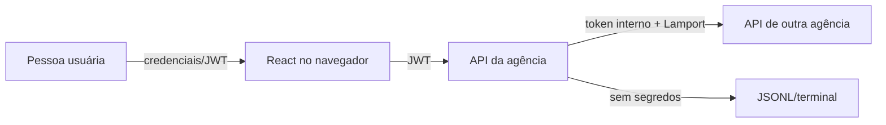

# Segurança — Sprint 1

## Status

Modelo implementado e validado. O ADR-003 está aceito.

## Objetivo

Atender aos requisitos acadêmicos de autenticação JWT e proteger a comunicação entre agências sem apresentar a Sprint 1 como um sistema bancário pronto para produção.

## Limites de confiança



- Navegador e entrada HTTP são não confiáveis.
- Uma agência confia em outra somente após validar a credencial interna.
- Logs e evidências são considerados públicos para fins acadêmicos; não podem conter segredos.
- Arquivos `.env` são locais e não devem entrar no Git.

## Ativos protegidos

- saldo e integridade das contas em memória;
- chave de assinatura JWT;
- hash da senha de demonstração;
- token interno entre agências;
- tokens JWT emitidos;
- detalhes operacionais que não precisam ser expostos.

## Autenticação do usuário

### Credenciais

- um usuário de demonstração configurado por ambiente;
- senha comparada por hash usando biblioteca apropriada;
- resposta genérica para usuário ou senha inválidos;
- nenhuma senha escrita em logs ou retornada pela API.

Essa decisão reduz o escopo. Ela não implementa cadastro, recuperação de senha ou vínculo entre usuário e conta.

### JWT

Claims implementadas:

| Claim | Uso |
|---|---|
| `sub` | identidade autenticada |
| `iat` | momento de emissão |
| `exp` | expiração obrigatória |
| `iss` | emissor ICEIBank |

Regras:

- algoritmo permitido fixado pelo servidor; nunca aceitar o algoritmo indicado pelo cliente sem restrição;
- segredo forte e comum às três instâncias locais;
- expiração configurável, com 15 minutos como valor inicial de desenvolvimento;
- 401 para token ausente, inválido ou expirado;
- mensagens diferenciadas por código para a interface, sem expor detalhes criptográficos;
- não registrar JWT completo.

## Autorização

A Sprint 1 possui autenticação, mas não autorização por titularidade. Depois de autenticado, o usuário pode operar qualquer conta cujo ID conheça.

Essa limitação é aceitável para o roteiro, desde que:

- seja descrita em `RESPOSTAS.md`;
- não seja apresentada como segurança bancária real;
- uma evolução futura exija vínculo usuário-conta e políticas por operação.

## Comunicação interna

`POST /contas/{id}/creditar-remoto` não usa o JWT do navegador. Ela exige o cabeçalho:

```text
X-ICEIBANK-INTERNAL-TOKEN: <token-configurado-localmente>
```

Razões:

- identidade de serviço é diferente da identidade do usuário;
- a agência de origem não precisa propagar o JWT recebido;
- o segredo interno nunca chega ao frontend;
- chamadas diretas não autenticadas ficam bloqueadas.

Regras:

- comparar tokens de forma resistente a diferenças de tempo quando suportado;
- rejeitar antes de aplicar crédito;
- usar o mesmo token interno nas três instâncias locais;
- não incluir o valor do token em exceções;
- testar ausência, valor incorreto e valor correto.

Em produção, esse mecanismo simples seria substituído por mTLS, identidade de workload ou tokens de serviço com rotação e escopo.

## Armazenamento do token no React

O plano usa `localStorage` por simplicidade didática e compatibilidade com o roteiro.

Riscos:

- qualquer script executado na página pode ler o token;
- uma vulnerabilidade XSS pode roubar a sessão;
- o token permanece após fechar o navegador até expirar ou ocorrer logout.

Controles mínimos:

- não renderizar HTML não confiável;
- não usar `dangerouslySetInnerHTML`;
- não carregar scripts desconhecidos;
- apagar o token no logout e ao receber 401;
- não exibir token na tela, console ou captura;
- manter dependências reduzidas.

Em um banco real, a preferência seria cookie `HttpOnly`, `Secure` e `SameSite`, com desenho explícito para CSRF.

## CORS

- permitir apenas `http://localhost:5173` durante a sprint;
- permitir os métodos e cabeçalhos realmente utilizados;
- não combinar origem curinga com credenciais;
- chamadas agência-a-agência não dependem de CORS, pois CORS é uma política do navegador.

## Validação de entrada

- IDs inteiros e não negativos;
- valores positivos, finitos e com até duas casas;
- nomes não vazios;
- agência e partição validadas no servidor;
- URL de agência escolhida a partir de lista fechada, nunca de URL arbitrária enviada pelo cliente;
- timeout em chamadas internas;
- mensagens remotas validadas por schema.
- competência mensal, categoria e limites financeiros validados no servidor;
- recomendação calculada somente com categorias flexíveis definidas pela pessoa usuária.

## Dados do controle financeiro

- descrições de gastos podem revelar hábitos pessoais;
- usar apenas dados fictícios nas evidências e no vídeo;
- não enviar planejamento ou gastos a serviços externos;
- não registrar descrição completa no terminal quando IDs/categoria/valor forem suficientes;
- proteger todas as rotas financeiras com JWT;
- não apresentar a recomendação como aconselhamento financeiro profissional.

## Logs seguros

Pode registrar:

- agência, tipo, Lamport e hora UTC;
- IDs de conta necessários para o exercício;
- valor e saldo conforme o roteiro;
- competência, categoria e valores agregados do controle financeiro;
- tipo resumido de falha.

Não pode registrar:

- senha ou hash;
- JWT;
- token interno;
- conteúdo integral de cabeçalhos;
- stack trace devolvida ao frontend;
- `.env`.
- descrições sensíveis de gastos sem necessidade técnica.

## Resposta a vazamento de segredo

Se um segredo aparecer no Git ou em evidência:

1. considerar o segredo comprometido;
2. gerar e configurar um valor novo em todas as instâncias;
3. invalidar tokens antigos ao trocar a chave JWT;
4. remover o segredo do arquivo/evidência;
5. avaliar a necessidade de limpar o histórico Git com orientação do professor;
6. documentar o incidente sem republicar o valor.

Apagar somente o commit mais recente não torna um segredo antigo automaticamente seguro.

## Verificações obrigatórias

| ID | Cenário | Esperado |
|---|---|---|
| SEG-01 | login inválido | 401 genérico |
| SEG-02 | rota de conta sem JWT | 401 |
| SEG-03 | JWT alterado | 401 |
| SEG-04 | JWT expirado | 401 e frontend retorna ao login |
| SEG-05 | rota interna sem token | 401 e saldo intacto |
| SEG-06 | rota interna com token errado | 401 e saldo intacto |
| SEG-07 | rota interna com token correto | crédito aplicado |
| SEG-08 | origem CORS não permitida | bloqueio pelo navegador |
| SEG-09 | logs após todos os testes | nenhum segredo encontrado |
| SEG-10 | controle financeiro sem JWT | 401 e nenhum dado retornado/alterado |

## Limitações assumidas

- HTTP local sem TLS.
- Segredos compartilhados manualmente entre processos.
- Sem revogação individual antes da expiração.
- Sem rate limit de login.
- Sem autorização por conta.
- Sem persistência segura de dados financeiros.

Essas limitações impedem uso real, mas não bloqueiam os objetivos acadêmicos da Sprint 1.

## Referências

- [ADR-003](decisions/ADR-003-autenticacao-e-comunicacao-interna.md)
- [Contrato da API](API_SPRINT_1.md)
- [Plano de testes](PLANO_DE_TESTES_E_EVIDENCIAS.md)
