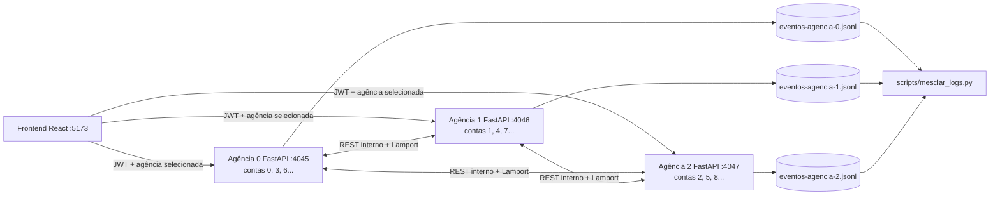
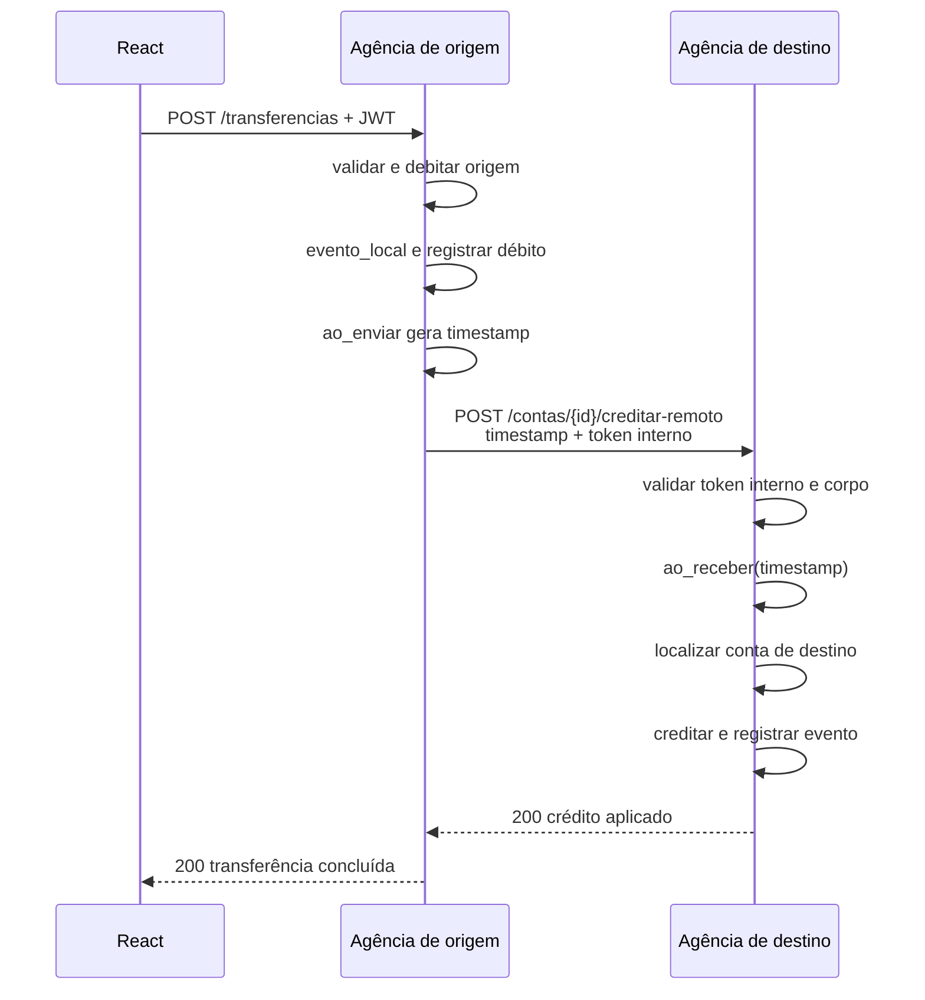

# SPEC-001: Arquitetura da Sprint 1 do ICEIBank

## Status

Implementada como baseline histórica da Sprint 1. A execução vigente evoluiu
para a Sprint 2: RabbitMQ e relógio vetorial substituíram o crédito remoto HTTP
e o relógio de Lamport. Revisada em 11/10/2026; ver SPEC-004 e ADR-007 para o
fluxo operacional atual.

## Objetivo

Registrar a arquitetura executável entregue na Sprint 1 do ICEIBank usando
Python/FastAPI e React. Esta especificação preserva a baseline de API
REST/MVC, particionamento, Lamport e comunicação HTTP direta; a arquitetura
ativa após a Sprint 2 é complementada e, nos pontos de mensageria e relógio,
substituída pela SPEC-004.

## Escopo

### Incluído

- um único código FastAPI executado como três processos de agência;
- contas particionadas por `id_conta % 3`;
- criação e consulta de conta, depósito e saque;
- transferência local e entre agências por REST;
- relógio de Lamport e log JSON Lines por agência;
- autenticação JWT para as rotas de uso da aplicação;
- cadastro básico de credenciais persistidas no SQLite da agência 0;
- autenticação separada para a comunicação interna;
- frontend React capaz de selecionar qualquer agência;
- script Python para mesclar logs;
- Controle Financeiro Mensal como funcionalidade adicional escolhida;
- testes, evidências, documentação e vídeo da Sprint 1.

### Excluído

- replicação ou banco de dados compartilhado entre agências;
- replicação de contas entre agências;
- rollback automático de transferência remota;
- 2PC, Saga ou outra transação distribuída;
- mensageria, relógio vetorial, consenso, containers e aplicativo Flutter;
- perfil completo de usuários, recuperação de senha e autorização por titularidade da conta;
- alta disponibilidade e execução com múltiplos workers por agência.

Os itens excluídos pertencem a sprints futuras ou excedem o necessário para esta entrega.

### Extensão: cadastro de usuários

O cadastro segue `auth_controller` → `AuthService` → `UsuarioRepository` → `Usuario`.
`CadastroRequest` valida o contrato HTTP e `security.py` calcula hashes PBKDF2 com salt.
O repositório SQLite usa a transação local para impedir nomes duplicados em requisições concorrentes.
No React, a página de login alterna para cadastro, reutilizando `AuthContext`, `apiRequest`,
`AgenciaSelector` e `AlertMessage`; o JWT retornado inicia a sessão.

Para preservar uma identidade única sem replicação ou banco compartilhado, a agência 0
processa cadastro e login. `AuthClient` encaminha essas operações das agências 1 e 2,
com timeout e erro 503 em caso de indisponibilidade. As operações bancárias continuam
particionadas e validam JWT localmente. A agência 0 é um ponto único de falha para novos
logins e cadastros; reiniciá-la preserva os usuários criados no SQLite local. Essa escolha
mantém uma única fonte de verdade para credenciais sem senhas divergentes entre processos.

## Contexto da baseline Sprint 1

- O repositório possui a aplicação implementada, testes e documentação das
  Sprints 1 e 2.
- O roteiro proíbe backend em Node.js e aceita Java ou Python.
- A decisão do aluno é usar Python/FastAPI por familiaridade e praticidade.
- A decisão do aluno é usar React por experiência prévia.
- O offset do RA é 45; portanto, a porta base das agências é 4045.
- A funcionalidade adicional é obrigatória na Sprint 1. O aluno escolheu um Controle Financeiro Mensal, detalhado separadamente na SPEC-002.

## Decisões relacionadas

- [ADR-001: Python/FastAPI e React](../decisions/ADR-001-stack-python-fastapi-react.md)
- [ADR-002: proposta de health-check substituída](../decisions/ADR-002-funcionalidade-adicional-health-check.md)
- [ADR-003: JWT e autenticação interna](../decisions/ADR-003-autenticacao-e-comunicacao-interna.md)
- [ADR-004: Controle Financeiro Mensal](../decisions/ADR-004-controle-financeiro-mensal.md)
- [ADR-007: RabbitMQ e relógio vetorial](../decisions/ADR-007-mensageria-rabbitmq-e-relogio-vetorial.md)
- [ADR-010: Persistência SQLite por agência](../decisions/ADR-010-persistencia-sqlite-por-agencia.md)
- [SPEC-002: Controle Financeiro Mensal](SPEC-002-controle-financeiro-mensal.md)
- [SPEC-004: Mensageria e relógio vetorial](SPEC-004-mensageria-e-relogio-vetorial.md)

## Visão de execução da Sprint 1 (histórica)



Cada agência é um processo independente e possui:

- arquivo SQLite próprio e repositórios locais;
- relógio de Lamport próprio;
- arquivo de eventos próprio;
- identidade e porta derivadas de `AGENCIA_ID`;
- as mesmas rotas e regras de negócio.

Não existe um servidor central coordenando as agências.

## Portas e identidade

Com `PORTA_BASE=4000+45`, a configuração é:

| Agência | `AGENCIA_ID` | Porta | URL | Contas de exemplo |
|---|---:|---:|---|---|
| Agência 0 | 0 | 4045 | `http://localhost:4045` | 0, 3, 6, 9 |
| Agência 1 | 1 | 4046 | `http://localhost:4046` | 1, 4, 7, 10 |
| Agência 2 | 2 | 4047 | `http://localhost:4047` | 2, 5, 8, 11 |
| Frontend | — | 5173 | `http://localhost:5173` | — |

A porta efetiva é `4045 + AGENCIA_ID`. IDs de agência diferentes de 0, 1 e 2 devem impedir a inicialização.

## Estrutura implementada do repositório

```text
ICEIBank/
├── agencia/
│   ├── pyproject.toml
│   ├── .env.example
│   ├── src/
│   │   └── iceibank/
│   │       ├── __init__.py
│   │       ├── main.py
│   │       ├── api/
│   │       │   ├── dependencies.py
│   │       │   └── router.py
│   │       ├── controllers/
│   │       │   ├── auth_controller.py
│   │       │   ├── contas_controller.py
│   │       │   ├── transferencias_controller.py
│   │       │   └── controle_financeiro_controller.py
│   │       ├── core/
│   │       │   ├── config.py
│   │       │   └── security.py
│   │       ├── models/
│   │       │   ├── conta.py
│   │       │   ├── evento.py
│   │       │   ├── gasto.py
│   │       │   └── planejamento_financeiro.py
│   │       ├── schemas/
│   │       │   ├── auth.py
│   │       │   ├── conta.py
│   │       │   ├── transferencia.py
│   │       │   └── controle_financeiro.py
│   │       ├── repositories/
│   │       │   ├── conta_repository.py
│   │       │   └── controle_financeiro_repository.py
│   │       └── services/
│   │           ├── auth_service.py
│   │           ├── agencia_client.py
│   │           ├── conta_service.py
│   │           ├── controle_financeiro_service.py
│   │           ├── recomendacao_economia_service.py
│   │           ├── transferencia_service.py
│   │           ├── relogio_lamport.py
│   │           └── registro_eventos.py
│   ├── scripts/
│   │   └── mesclar_logs.py
│   ├── data/
│   │   └── .gitkeep
│   └── tests/
│       ├── unit/
│       └── integration/
├── frontend/
│   ├── package.json
│   ├── vite.config.js
│   ├── .env.example
│   └── src/
│       ├── api/
│       │   └── cliente.js
│       ├── components/
│       ├── context/
│       │   ├── AuthContext.jsx
│       │   └── AgenciaContext.jsx
│       ├── hooks/
│       ├── pages/
│       │   ├── LoginPage.jsx
│       │   └── DashboardPage.jsx
│       ├── App.jsx
│       └── main.jsx
├── docs/
│   ├── decisions/
│   └── specs/
├── evidencias/
│   └── sprint1/
├── ROADMAP_SPRINT_1.md
├── RESPOSTAS.md
├── README.md
└── .gitignore
```

O roteiro usa nomes JavaScript apenas como exemplo. A estrutura acima mantém as mesmas responsabilidades em Python.

## Mapeamento MVC

FastAPI não impõe MVC clássico. Para atender à separação exigida sem forçar uma abstração artificial:

| Papel | Backend FastAPI | Frontend React |
|---|---|---|
| Model | `models/`, `schemas/`, `repositories/` e regras em `services/` | dados mantidos nos contexts/hooks e contratos do cliente HTTP |
| View | respostas JSON serializadas pelos schemas | componentes e páginas React |
| Controller | módulos em `controllers/`, usando `APIRouter` e delegando aos serviços | manipuladores de eventos e hooks que coordenam tela, estado e API |

Os controladores não devem alterar diretamente o dicionário de contas. Eles validam a requisição, chamam serviços e transformam exceções de domínio em respostas HTTP.

## Responsabilidades do backend

### `main.py`

- validar configuração na inicialização;
- criar a aplicação FastAPI;
- configurar CORS para o frontend;
- criar uma única instância de repositório, relógio e registro por processo;
- disponibilizar essas instâncias por dependências;
- agregar os controladores;
- registrar agência e porta no log de inicialização.

### `core/config.py`

- carregar variáveis de ambiente;
- validar `AGENCIA_ID`;
- calcular porta e URLs das três agências;
- implementar `agencia_responsavel(id_conta)`;
- centralizar expiração JWT, origem CORS e timeout de comunicação.

### `conta_repository.py`

- manter `dict[int, Conta]` privado ao processo;
- oferecer leitura, criação e atualização controladas;
- sincronizar operações críticas para evitar condição de corrida;
- não conter lógica HTTP.

### Serviços

- `conta_service.py`: partição, criação, consulta, depósito e saque;
- `transferencia_service.py`: transferências locais/remotas e falha conhecida;
- `relogio_lamport.py`: três operações atômicas do relógio;
- `registro_eventos.py`: append JSONL e saída legível no terminal;
- `agencia_client.py`: única camada autorizada a chamar outra agência;
- `auth_service.py`: credenciais, emissão e validação de JWT.

### Controladores

- recebem schemas Pydantic;
- obtêm serviços por `Depends`;
- não possuem regra de particionamento ou cálculo de saldo;
- retornam schemas de resposta e códigos HTTP explícitos;
- convertem erros conhecidos do domínio sem capturar exceções indiscriminadamente.

## Modelo de dados

### Conta

| Campo | Tipo | Regra |
|---|---|---|
| `id` | inteiro | maior ou igual a zero; imutável |
| `nomeAluno` | texto | obrigatório e não vazio |
| `saldo` | decimal | duas casas; nunca alterado fora do serviço |

Valores monetários devem usar `Decimal`, e não `float`, para evitar erros de representação binária. Entradas devem ser maiores que zero para depósito, saque e transferência.

### Evento

| Campo | Tipo | Finalidade |
|---|---|---|
| `agencia` | texto | origem do evento |
| `tipo` | texto | operação observada |
| `timestampLamport` | inteiro | ordem lógica local/causal |
| `horaParede` | ISO-8601 UTC | apoio operacional; não define causalidade |
| `detalhes` | objeto | IDs, valor, saldo ou erro relevante |

O formato deve permanecer compatível entre as três agências para permitir a mesclagem dos logs.

## Contrato HTTP da Sprint 1 (histórico)

### Rotas públicas e autenticadas

| Método | Rota | Proteção | Sucesso | Responsabilidade |
|---|---|---|---:|---|
| `POST` | `/auth/login` | pública | 200 | validar credenciais e emitir JWT |
| `POST` | `/contas` | JWT | 201 | criar conta na partição correta |
| `GET` | `/contas/{id}` | JWT | 200 | consultar conta e saldo |
| `POST` | `/contas/{id}/depositar` | JWT | 200 | depositar valor positivo |
| `POST` | `/contas/{id}/sacar` | JWT | 200 | sacar com saldo suficiente |
| `POST` | `/transferencias` | JWT | 200 | transferir local ou remotamente |
| `PUT` | `/contas/{id}/controle-financeiro/{competencia}/planejamento` | JWT | 200 | criar ou substituir planejamento mensal |
| `POST` | `/contas/{id}/controle-financeiro/gastos` | JWT | 201 | registrar gasto categorizado |
| `GET` | `/contas/{id}/controle-financeiro/{competencia}` | JWT | 200 | consultar resumo e recomendações |

### Rota interna da baseline

| Método | Rota | Proteção | Sucesso | Responsabilidade |
|---|---|---|---:|---|
| `POST` | `/contas/{id}/creditar-remoto` | token interno | 200 | aplicar crédito recebido de outra agência |

A rota interna preserva o caminho estabelecido no roteiro da Sprint 1. Ela foi
removida da execução atual pelo ADR-007; créditos remotos agora chegam pela
fila RabbitMQ da agência de destino.

### Erros padronizados

| Código | Uso |
|---:|---|
| 400 | regra de negócio inválida, partição incorreta ou saldo insuficiente |
| 401 | JWT/token interno ausente, inválido ou expirado |
| 404 | conta inexistente na agência |
| 409 | conta duplicada |
| 422 | corpo com formato ou tipo inválido, gerado pela validação Pydantic |
| 502 | agência de destino indisponível após o débito remoto |

O corpo de erro deve possuir ao menos `erro` e, quando útil, `codigo` para o frontend mapear mensagens sem depender do texto.

## Fluxos funcionais da Sprint 1 (históricos)

### Operação local

1. o controller valida o schema e o JWT;
2. o serviço verifica a partição e a existência da conta;
3. o serviço valida a regra financeira;
4. o repositório aplica a mudança sob sincronização;
5. o relógio executa `evento_local()`;
6. o registro grava o evento;
7. o controller devolve a resposta.

As validações devem acontecer antes da alteração do saldo.

### Transferência dentro da mesma agência

1. validar origem, destino, valor e saldo;
2. executar débito e crédito sob a mesma seção crítica;
3. chamar `evento_local()` para o débito e registrar `TRANSFERENCIA_DEBITO`;
4. chamar `evento_local()` para o crédito e registrar `TRANSFERENCIA_CREDITO`;
5. responder que a transferência local foi concluída.

Se o destino não existir, nenhum saldo deve ser alterado.

### Transferência entre agências



Se a chamada ao destino falhar, a origem registra `TRANSFERENCIA_FALHOU` e responde 502. O débito **não é revertido**, pois essa inconsistência é deliberada e será tratada somente na Sprint 4.

A autenticação interna e a validação estrutural do corpo acontecem antes do controller. Depois que uma mensagem válida de outra agência é aceita, o destino executa `ao_receber` **antes** de consultar e creditar a conta, como no roteiro. Se a conta não existir, o relógio ainda avança porque a mensagem foi recebida, embora o crédito seja rejeitado.

## Relógio de Lamport e concorrência (histórico)

Cada processo inicia seu contador em zero:

- `evento_local`: incrementa e retorna;
- `ao_enviar`: incrementa e retorna o timestamp enviado;
- `ao_receber(recebido)`: define `max(local, recebido) + 1` e retorna.

As três operações devem ser protegidas por lock. Alterações de saldo e escrita no JSONL também devem possuir sincronização apropriada.

Na Sprint 1, cada agência deve executar com **um único worker Uvicorn**. Vários workers criariam repositórios e relógios independentes para a mesma identidade de agência, violando o modelo. Isso deve ser declarado no README.

## Autenticação

### Usuário da aplicação

- credenciais de demonstração configuradas por ambiente;
- senha armazenada como hash, não em texto puro no repositório;
- todas as agências compartilham a configuração de assinatura para que um JWT válido possa ser usado após trocar a agência selecionada;
- token com `sub`, `iat`, `exp` e identificador do emissor;
- expiração curta e configurável;
- segredo JWT nunca versionado.

Essa solução implementa autenticação, mas não autorização por titularidade. Um usuário autenticado pode operar qualquer conta conhecida. A limitação deve ser reconhecida em `RESPOSTAS.md`.

### Comunicação entre agências

- usar um segredo interno compartilhado em cabeçalho dedicado;
- validar o cabeçalho antes de processar o crédito;
- não expor esse segredo ao React;
- manter timeout curto e configurável;
- registrar falha sem incluir segredo ou JWT nos logs.

## Frontend React

O frontend será criado com React e Vite, usando JavaScript modular para limitar a complexidade da sprint.

### Estado

- `AuthContext`: token, login, logout e expiração;
- `AgenciaContext`: agência atualmente selecionada e URLs permitidas;
- estado local dos formulários e resultados em cada página/componente.

### Cliente HTTP

`api/cliente.js` será o único ponto que:

- resolve a URL da agência selecionada;
- adiciona `Authorization: Bearer <token>`;
- converte respostas de erro para um formato comum;
- ao receber 401, limpa a sessão e direciona para login;
- distingue erro de negócio, erro HTTP e agência indisponível.

### Persistência do token

O token será mantido em `localStorage` para atender ao fluxo didático solicitado. Isso o torna acessível a JavaScript e, portanto, vulnerável a XSS; o frontend deve evitar HTML arbitrário e não registrar o token. Em uma aplicação bancária real, seria preferível um cookie `HttpOnly`, `Secure` e `SameSite`, com proteção adequada contra CSRF.

### Interface mínima

- página de login;
- seletor de agência 0, 1 ou 2;
- identificação da agência e status;
- consulta de conta/saldo;
- formulários de depósito e saque;
- formulário de transferência;
- painel de controle financeiro mensal;
- área visível para sucesso e erros;
- ação de logout.

O frontend envia sempre o mesmo contrato de transferência. A decisão entre fluxo local e remoto pertence exclusivamente ao backend.

## Funcionalidade adicional escolhida

O Controle Financeiro Mensal permite definir renda prevista, meta de economia e limites de categoria, registrar gastos e obter recomendações determinísticas de redução. Seus dados pertencem à mesma agência da conta e persistem no SQLite local.

A funcionalidade possui especificação própria na [SPEC-002](SPEC-002-controle-financeiro-mensal.md), deve ser implementada somente depois das partes obrigatórias e terá commit/evidência exclusivos.

## Configuração

### Backend

| Variável | Exemplo seguro | Obrigatória |
|---|---|---|
| `AGENCIA_ID` | `0` | sim |
| `PORTA_BASE` | `4045` | sim |
| `NUMERO_AGENCIAS` | `3` | sim |
| `JWT_SECRET` | definido localmente | sim |
| `JWT_EXPIRACAO_MINUTOS` | `15` | sim |
| `AUTH_USERNAME` | `aluno` | sim |
| `AUTH_PASSWORD_HASH` | hash local | sim |
| `INTERNAL_TOKEN` | definido localmente | sim |
| `FRONTEND_ORIGIN` | `http://localhost:5173` | sim |
| `TIMEOUT_AGENCIA_SEGUNDOS` | `3` | não |

### Frontend

| Variável | Valor |
|---|---|
| `VITE_AGENCIA_0_URL` | `http://localhost:4045` |
| `VITE_AGENCIA_1_URL` | `http://localhost:4046` |
| `VITE_AGENCIA_2_URL` | `http://localhost:4047` |

O arquivo `.env.example` contém apenas nomes e exemplos não secretos. Arquivos `.env` reais devem estar no `.gitignore`.

## Observabilidade

- um JSONL separado por agência em `agencia/data/`;
- mensagens de terminal com agência, Lamport, tipo e detalhes não sensíveis;
- script `python agencia/scripts/mesclar_logs.py` para unir a linha do tempo;
- ordenação primária por timestamp Lamport;
- desempate determinístico apenas para apresentação, deixando claro que não prova causalidade;
- captura da falha remota e do par de eventos concorrentes exigidos pelo roteiro.

Os arquivos JSONL não serão versionados. As evidências visuais serão versionadas.

## Estratégia de testes

### Unitários

- partição de IDs;
- três operações do relógio de Lamport;
- validações e mudanças de saldo;
- transferência local e saldo total;
- emissão/expiração de token;
- formatação de eventos.

### Integração

- contratos e códigos HTTP da API;
- proteção JWT;
- token interno na rota remota;
- transferência entre duas instâncias;
- falha com destino desligado;
- CORS para a origem autorizada.

### Manuais e evidências

- iniciar três processos reais;
- executar o fluxo completo pelo React;
- gerar os onze prints listados no roadmap;
- rodar o mesclador de logs;
- executar novamente as transferências após adicionar JWT;
- confirmar que outra pessoa consegue seguir o README.
- executar o cenário financeiro de meta de R$ 100,00 da SPEC-002.

## Restrições e premissas

- o estado financeiro persiste no SQLite local de cada agência, sem replicação entre elas;
- os logs são persistidos apenas para observação, não para reconstruir saldos;
- apenas um worker por agência;
- execução local em `localhost`;
- valores monetários possuem duas casas decimais;
- as três instâncias compartilham segredos apenas por configuração local;
- a falha de atomicidade remota é obrigatória e não deve ser corrigida nesta sprint;
- versões exatas das dependências serão fixadas ao criar o projeto e seu lockfile.

## Riscos

| Risco | Tratamento |
|---|---|
| relógio ou saldo sofre condição de corrida | locks, serviço central e testes concorrentes básicos |
| React chama a agência errada | seletor explícito e URLs fechadas em configuração |
| rota interna quebra após JWT | credencial interna própria e teste de regressão |
| segredo aparece em Git ou logs | `.env` ignorado e revisão antes do commit |
| erro monetário por `float` | uso de `Decimal` |
| múltiplos workers duplicam estado | comando oficial com um worker |
| frontend cresce além do prazo | uma página funcional após login, sem design elaborado |
| implementação acidental de rollback remoto | teste da falha conhecida e limite explícito da sprint |
| controle financeiro cresce além do MVP | seguir a SPEC-002 e implementar o extra somente depois dos obrigatórios |

## Critérios de aceitação

- três processos iniciam nas portas 4045, 4046 e 4047;
- cada processo aceita apenas sua partição;
- todas as mutações relevantes geram evento Lamport;
- transferência local preserva a soma dos saldos;
- transferência remota atualiza o relógio do destino com `max + 1`;
- destino indisponível produz 502, evento de falha e débito não revertido;
- JWT ausente, inválido ou expirado produz 401;
- token interno inválido impede crédito remoto;
- React cobre login, saldo, depósito, saque e transferências;
- erros aparecem na interface;
- controle financeiro calcula a meta de economia e recomenda cortes verificáveis;
- mesclador produz linha do tempo das três agências;
- evidências, respostas, commits e vídeo atendem ao roteiro.

## Estado operacional vigente

O código atual preserva as decisões de stack, MVC, JWT, partição de contas e
proxy Vite desta SPEC. O crédito remoto HTTP, `timestampLamport` e a falha
502 com débito não revertido não são o fluxo ativo: a execução usa publisher
confirm, RabbitMQ e `timestampVetorial`. Dados operacionais são persistidos em
SQLite por agência. Consultar a SPEC-004, o ADR-007, o ADR-010 e o documento
de estado atual antes de alterar o comportamento em produção local.

## Referências

- [Roadmap da Sprint 1](../../ROADMAP_SPRINT_1.md)
- Roteiro de Projeto — Sprint 1 fornecido pelo professor.
